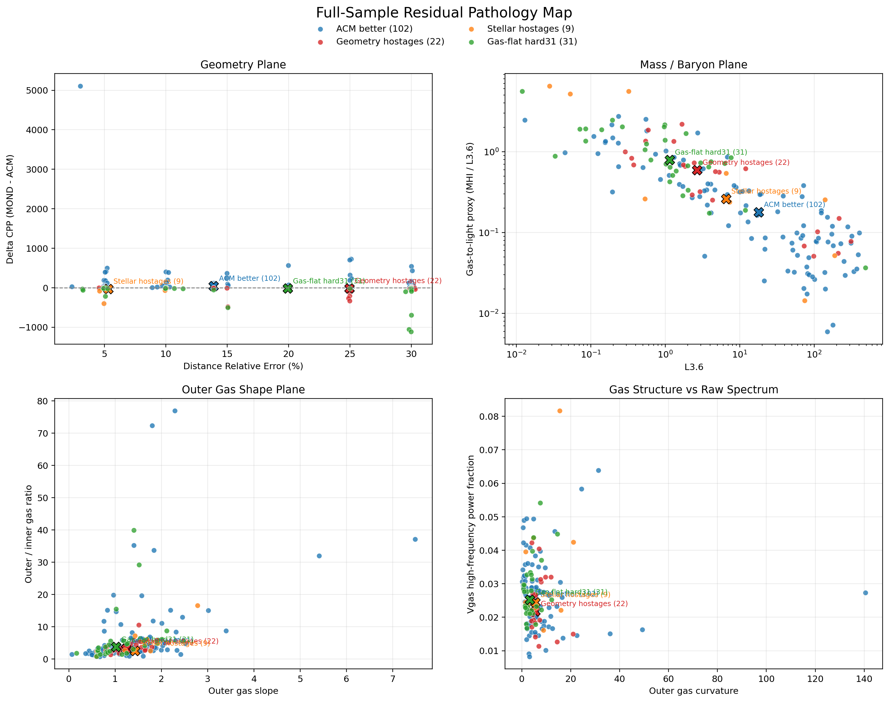
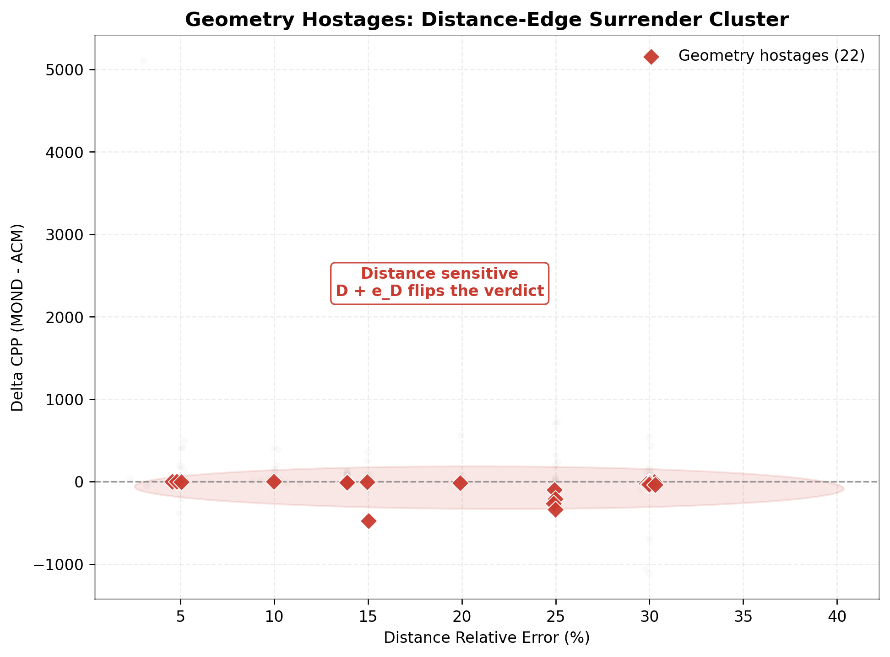
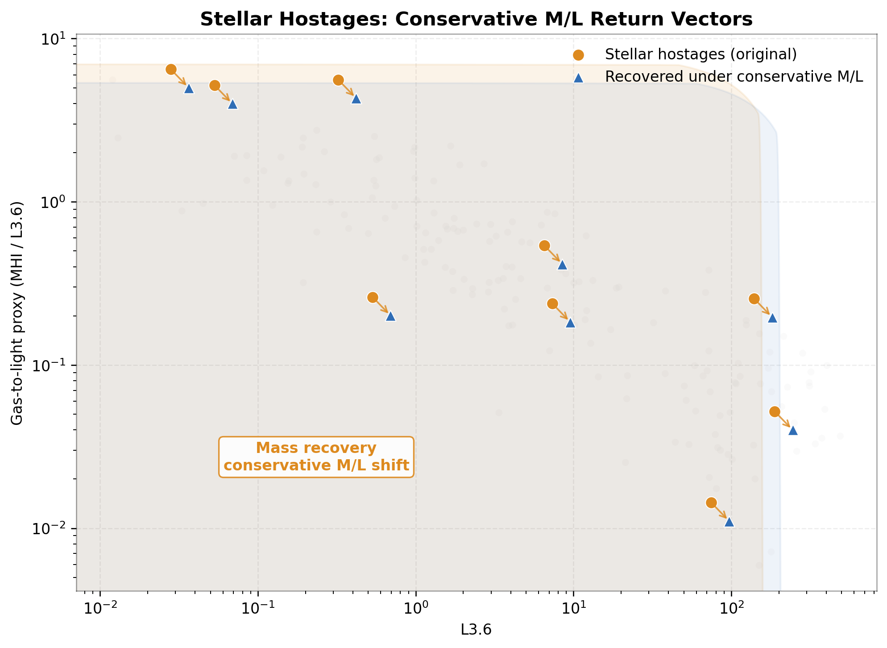
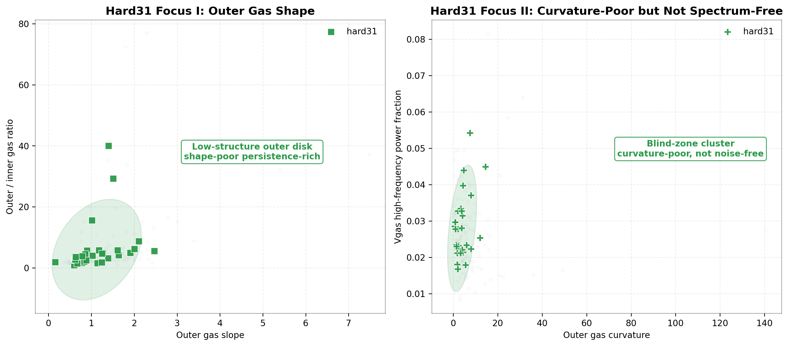
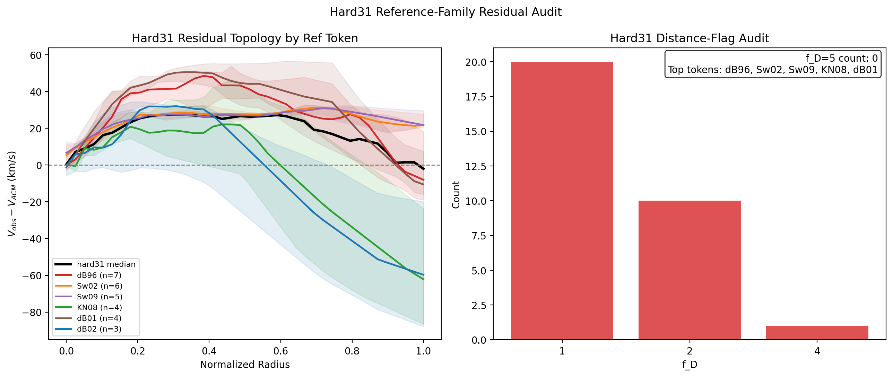

# Galaxy Audit System

## The Public Audit Terminal for the ACM vs MOND Forensics Paper

**One retained baseline. One residual minority. The evidence comes first.**

**一条保留基线，一组残差少数派，先把证据摆出来。**

> A clean public release of the second paper's interactive audit layer.  
> 一个面向第二篇论文公开发布的交互式审计层代码库。

## Primary Evidence | 首要证据

This figure is the first thing a reader should see, because it is the
signature evidence of Paper II. The `Residual Pathology Map` shows that the
apparent MOND-favored minority is not a single coherent counterexample class.
It decomposes into geometry hostages, stellar hostages, and the hard31
structure-poor outer-disk regime. This is the point of the audit in its
cleanest form: once the residual minority is separated into its actual
mechanisms, the same retained ACM baseline remains effective without inventing
a new rescue function for each pathological case.

这张图就是 Paper II 最关键的证据。`Residual Pathology Map` 直接显示：那些看
似偏向 MOND 的少数样本，并不是一个统一、连贯的反例群，而是被拆解为几何人
质、恒星人质，以及 `hard31` 这个结构贫瘠的外盘 regime。这也是第二篇审计的
关键结论：一旦把残差少数派按真实机制拆开，同一个保留 ACM 基线依然有效，
并不需要为每一种病理个案再发明一个营救函数。



**Quick Links | 快速导航**

[Scope](#-scope--项目定位) ·
[What This Repo Does](#-what-this-repo-does--这个仓库做什么) ·
[Evidence](#-evidence--证据主干) ·
[Paper Snapshot](#-paper-snapshot--论文快照) ·
[Paper Figures](#-paper-figures--论文主图) ·
[Quick Start](#-quick-start--快速开始) ·
[Deployment](#-deployment--github-pages-部署) ·
[Reproducibility](#-reproducibility--可复现结构) ·
[Citation](#-citation--引用方式) ·
[Data](#-data--数据与证据包) ·
[Relation to ACM_Project](#-relation-to-acm_project--与主研究仓库的关系)

---

## At a Glance | 一眼看懂

| Item | English | 中文 |
| --- | --- | --- |
| Scope | Public audit frontend and reproducible second-paper package | 第二篇论文的公开审计前端与可复现代码包 |
| Claim | MOND-favored regions are not a single coherent physical counterexample | MOND 优势区并不是一个统一、连贯的物理反例 |
| Core Output | Bilingual frontend, retained galaxy trunk, curated pathology evidence | 双语前端、保留星系主干、筛选后的病理证据包 |
| Role | Public evidence layer, not the full research archive | 面向公开的证据层，而不是完整研究档案 |

---

## Scope | 项目定位

This repository is the public release for the **second ACM paper**, centered on
an audit question rather than a generic model-comparison question.

The purpose is not simply to plot two curves and declare a winner. The purpose
is to inspect **why** certain galaxies look MOND-favored, how those verdicts
change under geometry and normalization stress, and whether the apparent MOND
advantage comes from physics, observation regime, or hidden data-model
correlations.

本仓库对应 **ACM 第二篇论文** 的公开发布版本。它的核心不是普通的模型对
比，而是一次真正的“审计”：为什么有些星系看起来偏向 MOND？这种偏向在距
离、倾角、质量归一化与气体结构审计下会不会变化？所谓 MOND 优势到底来自物
理本身，还是来自观测体制、输入假设与数据-模型相关性？

---

## What This Repo Does | 这个仓库做什么

This repository contains two layers:

1. **Interactive audit frontend**
   - bilingual (`EN` / `ZH`)
   - popular and expert views
   - galaxy-by-galaxy comparison terminal
   - pathology map and verdict card

2. **Minimal reproducible core**
   - retained galaxy-side ACM trunk used by the second paper
   - scripts for exporting the frontend bundle
   - curated evidence package for the pathology audit
   - archived audit scripts for the paper's main procedural chain
   - manuscript snapshot for the current paper-II release

本仓库包含两层：

1. **交互式审计前端**
   - 中英双语
   - 科普 / 学术双视图
   - 单星系对照终端
   - 病理地图与判决卡

2. **最小可复现核心**
   - 第二篇论文使用的保留版星系 ACM 主干
   - 前端数据包导出脚本
   - 病理审计所需的筛选证据包

---

## Philosophy | 核心思想

The first ACM paper establishes the retained rigid galaxy trunk.

This second-paper repository asks a different question:

**If MOND seems to win on a minority of galaxies, is that a single physical
regime, or a mixture of distinct hostage classes?**

The current audit structure separates the residual minority into different
regimes such as:

- geometry-sensitive systems
- stellar-normalization-sensitive systems
- gas-flat hard cases

第一篇论文建立的是保留下来的刚性星系主干。

而这个第二篇仓库追问的是另一件事：

**如果 MOND 在少数星系上看起来更好，那到底对应一个统一的物理区间，还是几
种完全不同的人质类型混在一起？**

当前审计结构把残差少数派拆成不同 regime，例如：

- 几何敏感样本
- 恒星归一化敏感样本
- 气体平坦硬骨头样本

---

## Evidence | 证据主干

The core public evidence included here is the pathology audit backbone of the
second paper.

It includes:

- full-sample residual pathology tables
- the four-quadrant pathology map
- distance-edge surrender analysis
- holdout-40 mass-hostage audit
- hard31 gas-shape and reference-family audit
- raw `Vgas` spectrum comparison between hard31 and ACM-dominant galaxies

本仓库附带的核心公开证据，是第二篇论文的病理审计主骨架，包括：

- 全样本残差病理总表
- 四象限病理地图
- 距离边缘翻盘审计
- holdout40 质量人质审计
- hard31 气体形状与来源家族审计
- hard31 与 ACM 优势样本之间的原始 `Vgas` 频谱对照

---

## Paper Snapshot | 论文快照

The repository also carries a `paper/` snapshot of the current second-paper
manuscript release, including:

- `paper/main.tex`
- `paper/main.pdf`
- `paper/references.bib`
- `paper/EVIDENCE_INDEX.md`

This keeps the public audit interface, the reproducible code path, and the
current manuscript state in one place while the paper is still being refined.

本仓库同时附带第二篇论文当前版本的 `paper/` 快照，包括：

- `paper/main.tex`
- `paper/main.pdf`
- `paper/references.bib`
- `paper/EVIDENCE_INDEX.md`

这样在论文仍在继续润色期间，公开仓库中也能同时保留：

- 交互式审计界面
- 可复现代码路径
- 当前手稿状态

---

## Paper Figures | 论文主图

The main figure set used by the current paper-II manuscript is also exposed
directly in this repository as standalone image assets under
`data/evidence/core/`.

当前第二篇论文正文使用的主图，也已经作为独立图片文件直接放在本仓库的
`data/evidence/core/` 中。

### Figure 1 | Full-Sample Pathology Map


### Figure 2 | Geometry Hostages Focus



### Figure 3 | Stellar Hostages Focus



### Figure 4 | hard31 Structure Focus



### Figure 5 | hard31 Reference Topology



These figure files are the same public evidence-layer assets used to support
the current manuscript snapshot under `paper/`.

这些图片文件与 `paper/` 目录中的当前手稿快照相互对应，构成第二篇论文的
公开证据图层。

---

## Repo Layout | 仓库结构

```text
galaxy-audit-system/
  src/                 # frontend source
  public/data/         # exported frontend data bundle
  repro_core/          # minimal reproducible ACM trunk for paper 2
  paper/               # current paper-II manuscript snapshot
    scripts/
      audit_pipeline/  # paper-II audit-chain script snapshots
      archive_operators/ # archived no-new-parameter operator tests
  data/evidence/       # curated public evidence package
  README.md
  EVIDENCE_SCOPE.md
  DATA_SCHEMA.md
  package.json
```

Key locations:

- `src/`: frontend application source
- `public/data/`: generated JSON bundle consumed by the frontend
- `repro_core/`: reproducible retained galaxy trunk and export scripts
- `paper/`: current manuscript snapshot for Paper II
- `repro_core/scripts/audit_pipeline/`: research-script snapshots for the paper's main audit chain
- `repro_core/scripts/archive_operators/`: archived operator tests referenced by the appendices
- `data/evidence/core/`: curated evidence files used by the second paper
- `EVIDENCE_SCOPE.md`: what is included publicly and why
- `DATA_SCHEMA.md`: exported frontend bundle schema

关键位置：

- `src/`：前端源码
- `public/data/`：前端直接读取的导出数据包
- `repro_core/`：保留下来的星系主干与导出脚本
- `data/evidence/core/`：第二篇论文公开证据主干
- `EVIDENCE_SCOPE.md`：公开证据范围说明
- `DATA_SCHEMA.md`：前端数据结构说明

---

## Quick Start | 快速开始

Install dependencies:

安装依赖：

```bash
npm install
```

Sync the curated evidence package:

同步证据包：

```bash
npm run sync:evidence
```

Regenerate the frontend audit bundle from the retained trunk:

从保留主干重建前端数据包：

```bash
npm run export:data
```

Run the frontend locally:

启动本地前端：

```bash
npm run dev
```

Build the static site:

构建静态站点：

```bash
npm run build
```

---

## Deployment | GitHub Pages 部署

This repository is configured for GitHub Pages deployment from the
`main` branch via GitHub Actions.

Pages assumptions:

- repository name: `galaxy-audit-system`
- Vite base path: `/galaxy-audit-system/`
- output directory: `dist/`

To publish:

1. Enable **GitHub Pages** in repository settings.
2. Choose **GitHub Actions** as the source.
3. Push to `main`, or trigger the workflow manually.

如果未来改为自定义域名或更换仓库名，需要同步修改：

- `vite.config.ts` 中的 `base`
- GitHub Pages 的仓库设置

At the current stage, the repository is ready for Pages publication once the
public release is turned on.

---

## Reproducibility | 可复现结构

This repository is intentionally reproducible without mirroring the entire
research kitchen.

What is preserved here:

- the retained galaxy-side ACM trunk used by paper 2
- the scripts that export the frontend bundle
- the curated evidence package needed to reproduce the audit logic
- the archived paper-II audit scripts that generated the main pathology,
  distance-edge, stellar-normalization, hard31, and operator-archive outputs

What is **not** mirrored here:

- every exploratory branch in `ACM_Project`
- the full cosmology-side archive
- every intermediate table or temporary branch from the research workspace

## Reproducibility Tiers | 可复现层级

This repository now exposes three reproducibility tiers:

1. **Frontend tier**
   - the bilingual audit terminal under `src/` and `public/data/`
2. **Stable trunk tier**
   - the retained ACM galaxy trunk under `repro_core/acm_audit_repro/`
3. **Audit-process tier**
   - the paper-II script snapshots under:
     - `repro_core/scripts/audit_pipeline/`
     - `repro_core/scripts/archive_operators/`

The third tier is included so that the procedural audit described in the paper
can be inspected directly rather than inferred only from exported tables. These
scripts are preserved as research snapshots. They are meant to expose the audit
logic and provenance chain even where further cleanup may still be desirable.

本仓库的原则是：在可复现的前提下，避免把完整研究厨房整体搬进来。

这里保留的是：

- 第二篇论文使用的保留版星系 ACM 主干
- 前端数据导出脚本
- 足以复现审计逻辑的筛选证据包

这里**不**包含的是：

- `ACM_Project` 中的全部探索分支
- 完整宇宙学档案
- 所有失败算子与全部中间实验残骸

---

## Data | 数据与证据包

The frontend consumes exported JSON bundles under `public/data/`.
Those bundles are generated from the reproducible core.

The pathology audit evidence included in `data/evidence/core/` is a curated,
public-facing subset of the larger research asset tree.

前端读取的是 `public/data/` 下的导出 JSON 数据包，这些数据由 `repro_core`
直接生成。

而 `data/evidence/core/` 中的病理审计证据，则是从更大的研究资产树中筛出来的
公开子集，用来支撑第二篇论文的核心叙事。

---

## Relation to ACM_Project | 与主研究仓库的关系

This repository is intentionally separate from `ACM_Project`.

- `ACM_Project` remains the research and model-production workspace
- `galaxy-audit-system` is the public-facing audit terminal for the second paper

The two repositories are related, but not identical in scope.

本仓库刻意与 `ACM_Project` 分离：

- `ACM_Project` 继续承担研究与模型生产职责
- `galaxy-audit-system` 则是第二篇论文面向公开的审计终端

两者相关，但范围并不相同。

---

## Design Direction | 设计气质

Keywords:

- forensic
- terminal-like clarity
- editorial seriousness
- controlled tension

关键词：

- 取证感
- 终端式清晰度
- 编辑式严肃感
- 受控张力

---

## Citation | 引用方式

If you use this repository, please cite the accompanying ACM second-paper
manuscript and acknowledge the SPARC data source where applicable.

如果你使用本仓库，请引用对应的 ACM 第二篇论文，并在适用情况下注明 SPARC
数据来源。

Repository metadata for citation managers is provided in:

- `CITATION.cff`
- `LICENSE`
